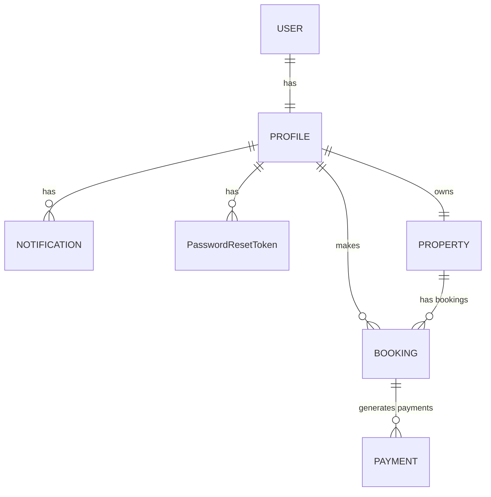

StayEase
===========
StayEase is a Django-based multi-app platform designed to manage properties, bookings, payments, and user accounts. The repository contains a fully structured Django project with several interconnected apps (accounts, bookings, properties, payments, dashboard) and a SQLite database for quick-start development. The project ships with sample media assets and a working admin interface, migrations for core models, and unit tests across apps.

Tech Stack
----------
- Backend: Django (Python)
- Database: SQLite (db.sqlite3 included for quick start)
- Frontend: HTML, CSS, JavaScript (static assets under static/)
- Media: Image assets under StayEase/media/
- Other: Django migrations for evolving the data model, testing modules in multiple apps

Prerequisites
-------------
- Python 3.x (Django projects typically target Python 3.8+; adapt to your environment)
- Virtual environment support (virtualenv, pyenv, or venv)
- Basic tooling: pip, python (PATH accessible)

Note: The repository includes a pre-populated SQLite database (StayEase/db.sqlite3) for quick-start usage. For a production-like workflow, run migrations to build the schema from scratch.

Installation
------------
1. Create and activate a virtual environment
   - Linux/macOS:
     - python3 -m venv venv
     - source venv/bin/activate
   - Windows:
     - python -m venv venv
     - venv\Scripts\activate

2. Install Django (and any other dependencies you need)
   - The repo does not include a requirements.txt, so install Django manually (and any additional libraries you require):
     - pip install django
     - Optionally install Pillow for image support: pip install pillow

3. Obtain the project code (already present in the repository)
   - Ensure you are in the StayEase root directory (the one that contains manage.py)

4. Database setup
   - Development with the included SQLite DB:
     - If you want to start from scratch (recommended for clean dev), delete StayEase/db.sqlite3 and run migrations:
       - python manage.py makemigrations
       - python manage.py migrate
   - If you want to preserve data from StayEase/db.sqlite3, you can start the server as-is after creating a superuser and applying migrations as needed.

5. Create a superuser (for admin access)
   - python manage.py createsuperuser
   - Follow prompts to create admin credentials

6. Run the development server
   - python manage.py runserver 8000
   - Open http://127.0.0.1:8000/ (or the host/port you configured)

Usage
-----
- Admin Dashboard:
  - Access via /admin to manage accounts, properties, bookings, payments, and dashboard data.
- Public/User Features (inferred from apps and migrations):
  - Accounts app handles user authentication, profiles, and signals. Migrations indicate support for Profile with phone and role fields and a Notification model, plus a PasswordResetToken mechanism.
  - Properties app handles listing, ownership, and related forms and views.
  - Bookings app handles reservation logic (dates, status, etc.) and related views.
  - Payments app handles payment models and processes.
  - Dashboard app provides admin-facing analytics and models for the project.
- Media and assets:
  - The repository includes a set of sample media for properties and profile pictures under StayEase/media/. These assets can help you visualize and test UI components.

Architecture and Repository Structure
-------------------------------------
Project root
- manage.py
- StayEase/
  - stayease (project package; contains project-level settings, URLs, WSGI/ASGI)
  - accounts/
    - __init__.py, adapter.py, admin.py, apps.py, context_processors.py, migrations/ (0001_initial.py … 0008_notification.py), models.py, signals.py, urls.py, views.py
    - Migrations indicate a user profile model with fields such as phone and profile_role, a PasswordResetToken, and a Notification model.
  - bookings/
    - __init__.py, admin.py, apps.py, migrations/ (0001_initial.py, 0002_rename_check_in_booking_move_in_date_and_more.py), models.py, tests.py, urls.py, views.py
    - Core Booking model; migration titles imply history around check-in/move-in date handling.
  - dashboard/
    - __init__.py, admin.py, apps.py, migrations/__init__.py, models.py, tests.py, views.py
    - Admin/dashboard related models and views
  - payments/
    - __init__.py, admin.py, apps.py, migrations/ (0001_initial.py), models.py, tests.py, views.py
    - Payment models and related admin/views
  - properties/
    - __init__.py, admin.py, forms.py, models.py, migrations/ (0001_initial.py, 0002_alter_property_owner.py, 0003_remove_property_rent_property_address_and_more.py, 0004_propertypayment.py, 0005_delete_propertypayment.py, 0006_alter_property_address_alter_property_city_and_more.py, 0007_alter_property_address_alter_property_city_and_more.py), urls.py, views.py
    - Property listings and related data structures; migrations reveal owner relationships, address refactoring, and payment-related changes
  - static/
    - css/style.css, js/main.js
  - media/
    - profile_pics/, properties/, rooms/ (sample images and avatars)
  - templates/ (inferred from Django structure; not explicitly listed but typically used)
  - db.sqlite3 (SQLite database; included for quick-start)
  - __init__.py (project package init)
- .gitignore
- README (this file, historically added/replaced during commits)

Migrations and Data Model Overview
----------------------------------
- accounts:
  - 0001_initial, 0002_profile_role, 0003_alter_profile_phone_alter_profile_role, 0004_passwordresettoken, 0005_userprofile, 0006_alter_userprofile_phone, 0007_userprofile_role, 0008_notification
  - Indicates a Profile with phone, role, PasswordResetToken support, and a Notification system; signals and adapters present for model integration.
- bookings:
  - 0001_initial, 0002_rename_check_in_booking_move_in_date_and_more
  - Suggests a Booking model with fields related to check-in/move-in dates and other booking-related data.
- properties:
  - 0001_initial, 0002_alter_property_owner, 0003_remove_property_rent_property_address_and_more, 0004_propertypayment, 0005_delete_propertypayment, 0006_alter_property_address_alter_property_city_and_more, 0007_alter_property_address_alter_property_city_and_more
  - Indicates property ownership, address/equipment fields, and an evolution of a property payment association.
- payments:
  - 0001_initial
  - Basic payment models, possibly tied to bookings or properties.
- dashboard:
  - migrations/__init__.py (and related models in dashboard/models.py)
  - Admin/dashboard analytics and admin-facing data structures.

ER Diagrams
-----------
To visualize the entities and their relationships, below is a detailed ER diagram in Mermaid syntax, followed by a textual summary of the main entities and relationships derived from the codebase.

- Mermaid ER Diagram (embedded)

- Entity-Relationship Summary
  - USER
    - One-to-one relationship with PROFILE (each user has a single profile)
  - PROFILE
    - Has fields such as phone and profile_role (from migrations)
    - One-to-many relationship with NOTIFICATION
    - One-to-many relationship with PasswordResetToken
    - One-to-many relationship with PROPERTY (as owner)
    - One-to-many relationship with BOOKING (as the booker)
  - PROPERTY
    - Owned by a PROFILE (owner)
    - One-to-many relationship with BOOKING (bookings for the property)
  - BOOKING
    - Linked to a PROFILE (the user who makes the booking)
    - Linked to a PROPERTY (the property being booked)
    - One-to-many relationship with PAYMENT (payments associated with the booking)
  - PAYMENT
    - Related to a BOOKING (payments tied to bookings and their flows)

Notes
  - The diagram captures the high-level relationships reflected in the migrations:
    - Profile, Notification, and PasswordResetToken models in accounts
    - Property ownership and bookings in properties and bookings
    - Payments in payments, potentially connected to bookings or properties
  - Some fields and exact foreign-key naming conventions may vary in the actual models; the diagram abstracts to clearly show cardinalities and primary relations.

Usage Tips for ER Diagrams
  - If you’re using GitHub with Mermaid support enabled, the diagram above will render directly on the README.
  - For a static image, you can export the Mermaid diagram to PNG/SVG using tools like mermaid-cli (mmdc) or online Mermaid editors.
  - You can also generate a PlantUML version if you prefer that tooling; I can provide a PlantUML variant upon request.

Data, Assets, and Environment Notes
-----------------------------------
- Media assets: The repository includes a set of sample media under StayEase/media (profile_pics, properties, rooms) which are useful for development and UI testing.
- Static assets: CSS and JavaScript files are present in StayEase/static (css/style.css, js/main.js) to support the frontend UI.
- Database: A pre-populated SQLite database StayEase/db.sqlite3 exists for quick-start usage; consider migrating to reflect your own data state, especially if you plan to run tests or production-like scenarios.

Testing
-------
- Each app includes a tests.py file (accounts/tests.py, bookings/tests.py, dashboard/tests.py, properties/tests.py, payments/tests.py). This indicates there are unit tests you can run via:
  - python manage.py test
- Running tests will require a test database setup (Django test runner handles this by default).

Contributing
------------
- If you want to contribute, follow these general steps:
  - Fork the repository and create a feature branch.
  - Install dependencies in a virtual environment.
  - Run migrations and ensure the project runs locally.
  - Add or update tests for new features.
  - Run tests and ensure all pass before submitting a pull request.
  - Ensure code follows your project’s style and naming conventions.
- Given there’s no explicit CONTRIBUTING.md in the repository, align with common Django project practices: keep migrations small and focused, write clear tests, and document API/UX changes where relevant.

Common Commands and Tips
------------------------
- Run migrations and collect static files (if you add static assets or templates):
  - python manage.py makemigrations
  - python manage.py migrate
  - python manage.py collectstatic (if you configure static files in production)
- Create a superuser for admin access:
  - python manage.py createsuperuser
- Run tests:
  - python manage.py test
- Start the server:
  - python manage.py runserver 8000
- Access admin panel:
  - http://127.0.0.1:8000/admin

Data, Assets, and Environment Notes
-----------------------------------
- Media assets: The repository includes a set of sample media under StayEase/media (profile_pics, properties, rooms) which are useful for development and UI testing.
- Static assets: CSS and JavaScript files are present in StayEase/static (css/style.css, js/main.js) to support the frontend UI.
- Database: A pre-populated SQLite database StayEase/db.sqlite3 exists for quick-start usage; consider migrating to reflect your own data state, especially if you plan to run tests or production-like scenarios.

Recent Commits (context)
------------------------
- 724e57c Remove readme.md file and its content (rajatrajan03)
- 962cd9f Add initial media assets and project documentation for StayEase platform (rajatrajan03)
- 748a6df first commit (rajatrajan03)

Project Summary
---------------
StayEase is a multi-app Django project organizing user accounts, property listings, bookings, payments, and a dashboard. It includes:

- A robust accounts module with profile information, roles, and password-reset tokens.
- A property management module to create and manage listings, including owner associations and address data.
- A bookings module to manage reservations with date fields and related logic.
- A payments module to handle financial transactions related to properties or bookings.
- A dashboard module for admin analytics and management UI.
- A suite of tests across apps to validate core functionality.

---
*Made with: [gittool.dev](https://gittool.dev)*
